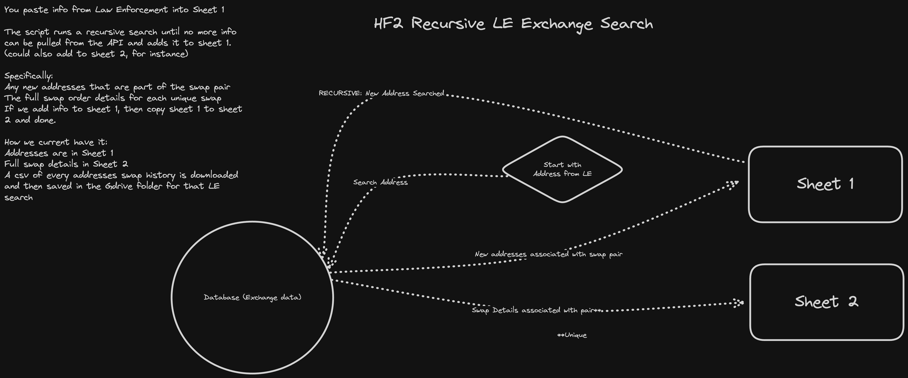

# HF2 LE Exchange Search

A little automation for the Hack Force II team.



### Basic info and requirement
- Search by address can be done via API but I believe the currency has to be included as well in order to return the results. 
- You can't define a time range via API, it'll just give you all that matches. 
- It has to include the fromAsset or the toAsset. 
- We don’t always receive the asset with the address. This will effect searching for EVM and TRX addresses. We’ll get all assets that match the address (ETH, BNB, TRX, USDT). 

- Match `TO ADDRESS` to `TO CURRENCY` & `FROM ADDRESS` to `FROM CURRENCY`

https://exchange.exodus.io/v3/orders?toAddress=31muhDdxQEE7E2MUUF3qunAKr4NR4Tn1Qy&toAsset=BTC

https://exchange.exodus.io/v3/orders?fromAddress=addr1q84x3qh7e0q6fldmj5mnk89vjlvgncsw5g9dmxmel4qt00j04mm39fw8l4pewc59xl59v7zszwye9vhuh3zwft8e5j9sslflq0&fromAsset=ADA

```curl

curl --user-agent "Mozilla/5.0 (X11; Linux x86\_64; rv:60.0) Gecko/20100101 Firefox/81.0" --location 'https://exchange.exodus.io/v3/orders?toAddress=TWZ5fhmREyszAwyfFESHcBanMwY42LEiuP&toAsset=TRX' \
--header 'App-Name: hf2_le_exchange_search' \
--header 'App-Version: 1.0.0' | fx .
```

```curl
curl --user-agent "Mozilla/5.0 (X11; Linux x86\_64; rv:60.0) Gecko/20100101 Firefox/81.0" --location 'https://exchange.exodus.io/v3/orders?fromAddress=TWZ5fhmREyszAwyfFESHcBanMwY42LEiuP&fromAsset=TRX' \
--header 'App-Name: hf2_le_exchange_search' \
--header 'App-Version: 1.0.0' | fx .

```

### Usage:
*Arguments can be `null`*
*Need to & from address ideally.*

```zsh
npm run search <fromAddress> <toAddress> <toCurrency> <fromCurrency>
```

